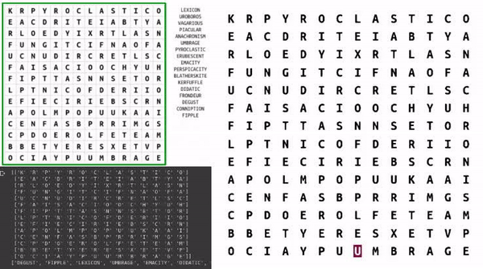

# word_search_solver_ocr
* Solving world searching using Tesseract engine (ocr)
* [run colab demo](https://colab.research.google.com/drive/1n7FEi3u9xdHKtQF7NXYdimJPzqm1dmMQ?usp=sharing)

# Image to Text Algorithm
1. Get sub-image (puzzle image or query image)
2. Binarize the image with otsu algorithm 
3. Perform a 5x5 closing operation.
4. * Query image: Find the contours bounding box that will extract word images
  * Puzzle image: Find the contours bounding box that will extract letter images 
5. Run tesseract on word/letter image to extract string
  * Config 1: Look only for char A-Z + 0 + p with --psm 10 (treat image as single char.)
  * Config 2: It text is not detected in config 1 then run just --psm 10
  * Finally perform a post correction with predefined map corrections = {'PP': 'P', '0': 'O', '': 'N'}
6. Return image texts and bboxes

